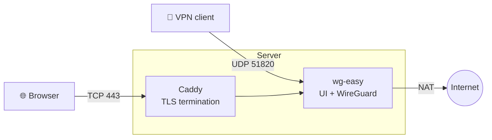

<div align="center">
# wg-easy-setup
 
**One script. A few questions. A WireGuard server that just works.**
 
Interactive installer for [wg-easy](https://github.com/wg-easy/wg-easy) v15 — built for rolling out
multiple VPN locations without tripping over overlapping subnets.
 
[](#)
[](#)
[](https://github.com/wg-easy/wg-easy)
[](https://caddyserver.com)
[](#)
 
[Quick start](#-quick-start) · [Features](#-features) · [Menu](#-management-menu) · [Troubleshooting](#-troubleshooting) · [🇩🇪 Deutsch](#-deutsch)
 
</div>
---
 
```
                        ./wg-easy-setup.sh
 
   ┌──────────────────────────────────────────────────────────┐
   │  1. Language        Deutsch / English                    │
   │  2. Access mode     HTTPS · plain HTTP · localhost       │
   │  3. Connection      host, UDP port, UI port              │
   │  4. Tunnel network  site number → own subnet             │
   │  5. Credentials     user, password, client DNS           │
   └──────────────────────────────────────────────────────────┘
                               ↓
                    summary → confirm → done
```
 
## ✨ Features
 
|  | |
|---|---|
| 🧭 **Guided** | No flags, no subcommands. Answer questions, review the summary, confirm. |
| 🌍 **Bilingual** | German or English, asked once and remembered. |
| 🔐 **HTTPS out of the box** | Caddy fetches and renews Let's Encrypt certificates automatically. |
| 🧮 **Collision-free subnets** | Site number → `10.8.<n>.0/24` + `fd08:0:<n>::/64`. Five servers, five clean routes. |
| 🛰️ **NAT aware** | Compares the local address with the externally visible one and warns you before clients get an unreachable endpoint. |
| 🩺 **Real diagnostics** | Tells you whether the container is broken or whether something in front of the server is filtering. |
| 🧹 **Cleans up** | Removes a previous plain-WireGuard setup, including an nftables ruleset that would block Docker. |
| ♻️ **Idempotent** | Run it again any time for status, logs, updates or a reconfigure. |
 
## 🚀 Quick start
 
```bash
chmod +x wg-easy-setup.sh
sudo ./wg-easy-setup.sh
```
 
That is the whole thing. Docker is installed automatically if missing.
 
> [!IMPORTANT]
> The script configures **nothing** at your hosting provider. Open the inbound ports there yourself —
> see [Ports](#-ports-to-open). Blocked inbound traffic is by far the most common reason a fresh
> install appears broken.
 
## 🏗️ How it fits together
 

 
In plain HTTP and localhost mode Caddy is left out and wg-easy publishes its own port.
 
## 🔑 Access modes
 
| Mode | Reachable at | TLS | Good for |
|---|---|:---:|---|
| **HTTPS + domain** | `https://vpn.example.net` | ✅ | Production. Needs an A record and TCP 80 + 443. |
| **Plain HTTP** | `http://<server-ip>:51821` | ❌ | Quick tests only. Password and client keys travel in the clear. |
| **Localhost only** | SSH tunnel | ✅ | Locked-down setups, and the fallback while provider ports are still closed. |
 
```bash
# Localhost mode: tunnel in from your machine
ssh -L 51821:127.0.0.1:51821 root@<server>
# then open http://127.0.0.1:51821
```
 
## 🧮 Tunnel networks
 
Enter a site number, get a subnet nothing else uses:
 
| Site | IPv4 | IPv6 |
|:---:|---|---|
| `1` | `10.8.1.0/24` | `fd08:0:1::/64` |
| `2` | `10.8.2.0/24` | `fd08:0:2::/64` |
| `3` | `10.8.3.0/24` | `fd08:0:3::/64` |
| `…` | `…` | `…` |
| `99` | `10.8.99.0/24` | `fd08:0:99::/64` |
 
Custom CIDRs are offered right after the preview. IPv4 and IPv6 must always be set together — wg-easy requires it.
 
## 🔌 Ports to open
 
| Access mode | Inbound |
|---|---|
| HTTPS + domain | `UDP 51820` · `TCP 80` · `TCP 443` |
| Plain HTTP | `UDP 51820` · `TCP 51821` |
| Localhost only | `UDP 51820` |
 
> [!NOTE]
> TCP 80 is required even in HTTPS mode — Let's Encrypt validates over it.
 
## 🎛️ Management menu
 
Run the script again on an installed server:
 
```
  1) Show status              6) Show credentials
  2) Show logs                7) Run diagnostics
  3) Restart                  8) Uninstall
  4) Update                   9) Quit
  5) Change settings
```
 
## 📁 Files
 
| Path | Contents |
|---|---|
| `/etc/docker/containers/wg-easy/docker-compose.yml` | Compose setup, regenerated each run |
| `/etc/docker/containers/wg-easy/.env` | Credentials and settings · mode `600` |
| `/etc/docker/containers/wg-easy/Caddyfile` | HTTPS mode only |
| Docker volume `etc_wireguard` | Clients, keys, database |
| `/root/wg-setup-alt/` | Files moved aside from a previous install |
 
## ⚠️ Known limitations
 
> [!WARNING]
> **`INIT_*` settings only apply on the very first container start.** wg-easy reads them once, against an
> empty database. Changing username, password, host, DNS or tunnel network through menu item 5 therefore
> has **no effect** on an existing installation — use the web interface's admin area instead. For the
> tunnel network the script warns and offers to recreate the container, which **deletes all clients**.
 
- **Changing the WireGuard port later is risky.** The published port changes, the service inside keeps listening on the old one. Change it in the web interface.
- **No backup function yet.** Everything lives in the `etc_wireguard` volume. Back it up before recreating anything.
## 🩺 Troubleshooting
 
<details>
<summary><b>Web interface unreachable from outside, but diagnostics say it responds locally</b></summary>
The container is fine — something in front of the server filters. Check the security group or firewall
at your provider. Test **from another machine**, never from the server itself:
 
```bash
nc -zv <server-ip> 80
nc -zv <server-ip> 443
```
 
Running this on the server itself always succeeds and proves nothing.
</details>
<details>
<summary><b>Caddy logs <code>Timeout during connect (likely firewall problem)</code></b></summary>
Let's Encrypt cannot reach the server — same cause as above. Switch to localhost mode via menu item 5
to stop the retry loop, otherwise you burn through the rate limit of **five failed validations per
hostname per hour**.
</details>
<details>
<summary><b><code>IPv4 address is not within the CIDR range</code> when creating a client</b></summary>
The client address falls outside the interface CIDR — typically after changing the CIDR while clients
already existed. Check the interface settings in the admin area, then either keep the suggested address
or recreate the affected clients.
</details>
<details>
<summary><b>No handshake although the web interface works</b></summary>
Most providers filter UDP separately from TCP. If unusual UDP ports are blocked, move WireGuard to
`UDP 443`.
</details>
<details>
<summary><b><code>nft: command not found</code> / <code>sysctl: command not found</code></b></summary>
Both live in `/usr/sbin`, which is missing from `PATH` in a root shell entered via `su` without `-`.
The script sets its own `PATH`, so this only affects commands you type by hand.
</details>
## 📋 Requirements
 
- Debian 12 / 13 or Ubuntu 22.04 / 24.04, freshly installed
- Root access and an interactive terminal
- Outbound internet access
## 🙏 Credits
 
[wg-easy](https://github.com/wg-easy/wg-easy) is licensed under **AGPL-3.0**. This script only automates
its deployment and is not affiliated with the project.
Docs: [wg-easy.github.io](https://wg-easy.github.io/wg-easy/latest/)
 
---
 
<div align="center">
## 🇩🇪 Deutsch
 
</div>
<details>
<summary><b>Vollständige deutsche Anleitung aufklappen</b></summary>
<br>
### ✨ Auf einen Blick
 
|  | |
|---|---|
| 🧭 **Geführt** | Keine Parameter, keine Unterbefehle. Fragen beantworten, Zusammenfassung prüfen, bestätigen. |
| 🌍 **Zweisprachig** | Deutsch oder Englisch, einmal gefragt und gemerkt. |
| 🔐 **HTTPS ab Werk** | Caddy holt und erneuert Let's-Encrypt-Zertifikate automatisch. |
| 🧮 **Netze ohne Überschneidung** | Standort-Nummer → `10.8.<n>.0/24` + `fd08:0:<n>::/64`. Fünf Server, fünf saubere Routen. |
| 🛰️ **NAT-Erkennung** | Vergleicht lokale und von außen sichtbare Adresse und warnt, bevor Clients einen unerreichbaren Endpoint bekommen. |
| 🩺 **Echte Diagnose** | Sagt dir, ob der Container kaputt ist oder ob vor dem Server gefiltert wird. |
| 🧹 **Räumt auf** | Entfernt eine frühere reine WireGuard-Installation samt nftables-Regelwerk, das Docker blockieren würde. |
| ♻️ **Wiederholbar** | Jederzeit erneut startbar für Status, Logs, Updates oder Umkonfiguration. |
 
### 🚀 Schnellstart
 
```bash
chmod +x wg-easy-setup.sh
sudo ./wg-easy-setup.sh
```
 
Mehr ist es nicht. Docker wird bei Bedarf automatisch installiert.
 
> [!IMPORTANT]
> Beim Hoster richtet das Skript **nichts** ein. Die eingehenden Ports musst du dort selbst freigeben.
> Blockierter eingehender Verkehr ist mit Abstand der häufigste Grund, warum eine frische Installation
> kaputt aussieht.
 
### 🔑 Zugriffsarten
 
| Variante | Erreichbar unter | TLS | Geeignet für |
|---|---|:---:|---|
| **HTTPS + Domain** | `https://vpn.example.net` | ✅ | Produktivbetrieb. Braucht A-Record und TCP 80 + 443. |
| **Einfaches HTTP** | `http://<server-ip>:51821` | ❌ | Nur für schnelle Tests. Passwort und Client-Schlüssel gehen im Klartext raus. |
| **Nur lokal** | SSH-Tunnel | ✅ | Abgeschottete Setups, und als Rückfallebene solange die Ports beim Hoster noch zu sind. |
 
```bash
# Lokaler Modus: von deinem Rechner aus tunneln
ssh -L 51821:127.0.0.1:51821 root@<server>
# danach http://127.0.0.1:51821 öffnen
```
 
### 🧮 Tunnelnetze
 
Standort-Nummer eingeben, eindeutiges Subnetz bekommen:
 
| Standort | IPv4 | IPv6 |
|:---:|---|---|
| `1` | `10.8.1.0/24` | `fd08:0:1::/64` |
| `2` | `10.8.2.0/24` | `fd08:0:2::/64` |
| `3` | `10.8.3.0/24` | `fd08:0:3::/64` |
| `…` | `…` | `…` |
| `99` | `10.8.99.0/24` | `fd08:0:99::/64` |
 
Eigene Bereiche werden direkt nach der Vorschau angeboten. IPv4 und IPv6 müssen immer zusammen gesetzt
werden, das verlangt wg-easy so.
 
### 🔌 Freizugebende Ports
 
| Zugriffsart | Eingehend |
|---|---|
| HTTPS + Domain | `UDP 51820` · `TCP 80` · `TCP 443` |
| Einfaches HTTP | `UDP 51820` · `TCP 51821` |
| Nur lokal | `UDP 51820` |
 
> [!NOTE]
> TCP 80 wird auch im HTTPS-Modus gebraucht — Let's Encrypt validiert darüber.
 
### 🎛️ Verwaltungsmenü
 
Skript auf einem installierten Server erneut starten:
 
```
  1) Status anzeigen          6) Zugangsdaten anzeigen
  2) Logs anzeigen            7) Diagnose ausführen
  3) Neu starten              8) Deinstallieren
  4) Aktualisieren            9) Beenden
  5) Einstellungen ändern
```
 
### 📁 Dateien
 
| Pfad | Inhalt |
|---|---|
| `/etc/docker/containers/wg-easy/docker-compose.yml` | Compose-Setup, wird bei jedem Lauf neu erzeugt |
| `/etc/docker/containers/wg-easy/.env` | Zugangsdaten und Einstellungen · Modus `600` |
| `/etc/docker/containers/wg-easy/Caddyfile` | Nur im HTTPS-Modus |
| Docker-Volume `etc_wireguard` | Clients, Schlüssel, Datenbank |
| `/root/wg-setup-alt/` | Beiseitegeräumte Dateien einer früheren Installation |
 
### ⚠️ Bekannte Einschränkungen
 
> [!WARNING]
> **Die `INIT_*`-Einstellungen wirken nur beim allerersten Containerstart.** wg-easy liest sie genau
> einmal, gegen eine leere Datenbank. Benutzername, Passwort, Host, DNS oder Tunnelnetz über Menüpunkt 5
> zu ändern hat auf einer bestehenden Installation daher **keine Wirkung** — nimm dafür den Adminbereich
> der Weboberfläche. Beim Tunnelnetz warnt das Skript und bietet an, den Container neu aufzusetzen,
> wobei **alle Clients gelöscht werden**.
 
- **Den WireGuard-Port nachträglich zu ändern ist heikel.** Die Veröffentlichung ändert sich, der Dienst im Container lauscht weiter auf dem alten Port. Ändere ihn in der Weboberfläche.
- **Noch keine Backup-Funktion.** Alles liegt im Volume `etc_wireguard`. Sichere es, bevor du etwas neu aufsetzt.
### 🩺 Fehlersuche
 
<details>
<summary><b>Weboberfläche von außen nicht erreichbar, laut Diagnose antwortet sie aber lokal</b></summary>
Der Container ist in Ordnung — davor filtert etwas. Prüfe Security Group oder Firewall beim Anbieter.
Teste **von einem anderen Rechner aus**, niemals vom Server selbst:
 
```bash
nc -zv <server-ip> 80
nc -zv <server-ip> 443
```
 
Auf dem Server selbst gelingt der Test immer und beweist nichts.
</details>
<details>
<summary><b>Caddy meldet <code>Timeout during connect (likely firewall problem)</code></b></summary>
Let's Encrypt erreicht den Server nicht — gleiche Ursache wie oben. Stell über Menüpunkt 5 auf „nur
lokal" um, damit die Wiederholungen aufhören. Sonst verbrennst du das Kontingent von **fünf
fehlgeschlagenen Validierungen pro Hostname und Stunde**.
</details>
<details>
<summary><b><code>IPv4 address is not within the CIDR range</code> beim Anlegen eines Clients</b></summary>
Die Client-Adresse liegt außerhalb der Interface-CIDR — typischerweise, nachdem die CIDR geändert wurde,
während schon Clients existierten. Sieh im Adminbereich nach, was beim Interface eingetragen ist, und
belasse es entweder bei der vorgeschlagenen Adresse oder lege die betroffenen Clients neu an.
</details>
<details>
<summary><b>Kein Handshake, obwohl die Oberfläche läuft</b></summary>
Die meisten Anbieter filtern UDP getrennt von TCP. Sind ungewöhnliche UDP-Ports gesperrt, leg WireGuard
auf `UDP 443`.
</details>
<details>
<summary><b><code>nft: command not found</code> / <code>sysctl: command not found</code></b></summary>
Beide liegen in `/usr/sbin`, das in einer per `su` ohne `-` betretenen Root-Shell im `PATH` fehlt.
Das Skript setzt seinen `PATH` selbst, betroffen sind also nur Befehle, die du von Hand eingibst.
</details>
### 📋 Voraussetzungen
 
- Debian 12 / 13 oder Ubuntu 22.04 / 24.04, frisch installiert
- Root-Zugang und ein interaktives Terminal
- Ausgehender Internetzugang
### 🙏 Hinweise
 
[wg-easy](https://github.com/wg-easy/wg-easy) steht unter **AGPL-3.0**. Dieses Skript automatisiert
lediglich die Installation und gehört nicht zum Projekt.
Doku: [wg-easy.github.io](https://wg-easy.github.io/wg-easy/latest/)
 
</details>
